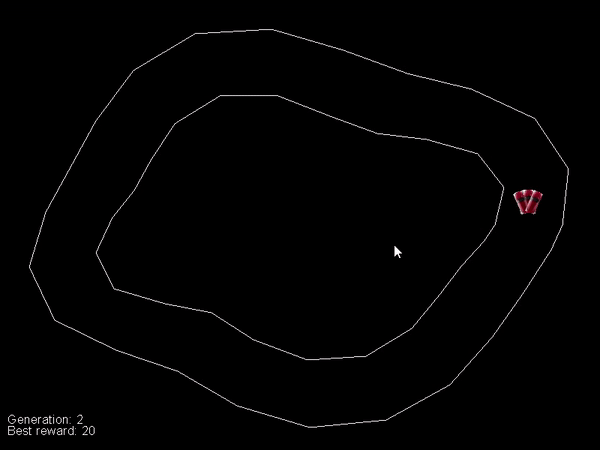

# Genetic2DCarGame
An AI is taught to beat a 2D car game with Genetic Algorithm for a Neural Network.

## Background
In this project a genetic algorithm generates 100 cars and 100 neural networks (NN). In each generation, the fittest species breed, trying to create better offspring. A little mutation is involved too.
* The NN inputs are the state of the cars, that is the distance of the walls around the car in certain angles. It can be imagined as a lidar.
* The output of the NN is the directions to move towards (left-forward, forward, right-forward).

## Fun facts
* As the NNs learn to move based on the distances of the walls around the car, it won't be track dependent.
* Learning to navigate on a track, maybe enough, to navigate on newly generated tracks.

## Built With
* [Python](https://www.python.org/)
* [pyglet](http://pyglet.org/) - The cross-platform windowing and multimedia library for Python
* [keras](https://keras.io/) - The Python Deep Learning library

## Authors

* **Kardos Tamás** - *Initial work* - [Swordy](https://github.com/swordey)
